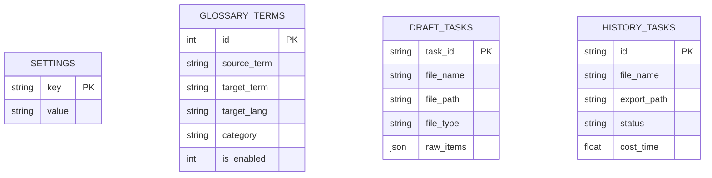

# TransFiler v1.0.0 源码全景深度解读文档

本文档对 **TransFiler 制造业文档双语智能转换系统（v1.0.0）** 的整体技术架构、各个核心模块的设计思想、底层算法以及关键源码进行全面、深入的解读。

---

## 目录
1. [系统整体架构与分层设计](#1-系统整体架构与分层设计)
2. [启动引导与前后端通讯机制 (`run.py` / `app.py`)](#2-启动引导与前后端通讯机制)
3. [核心文档高保真排版引擎源码解读 (`backend/core/`)](#3-核心文档高保真排版引擎源码解读)
   - 3.1 Word (`.docx`) 样式继承与双语段落/表格重构
   - 3.2 Excel (`.xlsx`) 自适应行高与自动折行算法
   - 3.3 CSV 编码自动探测与双语重构
   - 3.4 老版 `.doc` 兼容转换器
4. [大模型翻译与制造业术语匹配流水线](#4-大模型翻译与制造业术语匹配流水线)
   - 4.1 制造业专有术语精准匹配与提示词约束 (`glossary_matcher.py`)
   - 4.2 异步并发分块翻译与智能降级 (`translator.py`)
5. [数据持久化与草稿暂存工作流 (`database.py`)](#5-数据持久化与草稿暂存工作流)
6. [业务 API 路由设计 (`backend/routers/`)](#6-业务-api-路由设计)
7. [前端桌面工作台与双栏校对交互 (`frontend/`)](#7-前端桌面工作台与双栏校对交互)
8. [自动化测试与设计亮点总结](#8-自动化测试与设计亮点总结)

---

## 1. 系统整体架构与分层设计

TransFiler 采用经典的 **「桌面容器层 + RESTful API 调度层 + 核心文档/翻译处理内核 + 本地 SQLite 持久化」** 分层架构：

```
+-----------------------------------------------------------------------------------+
|                           1. 桌面展示层 (Presentation Layer)                        |
|   - PyWebView 桌面容器 (1280x850 原生窗口，自适应失败自动回退至系统浏览器)             |
|   - 单页 Web UI (Tailwind CSS + Lucide Icons + 响应式双栏校对工作台)               |
+-----------------------------------------+-----------------------------------------+
                                          | HTTP RESTful API / JSON
+-----------------------------------------v-----------------------------------------+
|                           2. 服务调度层 (FastAPI Service Layer)                    |
|   - 路由分发: /api/task (任务流程), /api/glossary (术语库), /api/settings (系统设置)   |
|   - 中间件: CORS 跨域、静态资源挂载 (/static)                                      |
+-----------------------------------------+-----------------------------------------+
                                          |
+-----------------------------------------v-----------------------------------------+
|                           3. 核心算法与处理内核 (Core Engines)                     |
|   - 文档引擎: python-docx (Word重构) / openpyxl (Excel行高自适应) / csv / win32com   |
|   - 术语引擎: Trie 树最长词优先匹配 / 制造业 Prompt 约束生成                       |
|   - 翻译引擎: httpx 异步并发批量切片 / 工业级提示词工程 / 本地 Mock 模式            |
+-----------------------------------------+-----------------------------------------+
                                          |
+-----------------------------------------v-----------------------------------------+
|                           4. 本地持久化与缓存层 (Storage Layer)                    |
|   - transfiler.db (SQLite): settings, glossary_terms, history_tasks, draft_tasks  |
|   - 本地目录: uploads/ (上传原件), exported_docs/ (导出双语成果)                    |
+-----------------------------------------------------------------------------------+
```

---

## 2. 启动引导与前后端通讯机制

### 2.1 启动入口：[`run.py`](file:///c:/Users/1460902/Desktop/Transfiler/run.py)
`run.py` 是整个 Windows 桌面应用程序的主启动入口，实现了 **双线程自起服务 + 桌面窗口拉起 + 优雅回退**：

1. **端口防冲突与多线程启动**：
   - 检查 `127.0.0.1:8765` 端口是否被占用，若未占用则在独立守护线程（Daemon Thread）中启动 `uvicorn.Server`；
   - 循环探测端口连通性（最多等待 5 秒），确保服务就绪后再唤起 UI。
2. **PyWebView 原生窗口与浏览器回退**：
   - 首先尝试使用 `pywebview.create_window` 创建 1280x850 的独立原生桌面窗口，设置 `min_size=(1024, 700)` 保证制造业复杂表格的展示宽度；
   - 若当前 Windows 环境缺少 WebView2 运行时，自动捕获异常并通过 `webbrowser.open("http://127.0.0.1:8765")` 在默认浏览器中秒级打开，**保证 100% 启动成功率**。

### 2.2 服务核心：[`backend/app.py`](file:///c:/Users/1460902/Desktop/Transfiler/backend/app.py)
- 初始化 SQLite 数据库（自动创建表及预置 20+ 条常见制造业中英术语）；
- 挂载 4 组功能 API 路由：`api_settings`, `api_glossary`, `api_translate`, `api_history`；
- 将 `frontend/` 目录挂载至 `/static` 静态文件路径，访问根路径 `/` 直接返回 `index.html`。

---

## 3. 核心文档高保真排版引擎源码解读

这是本项目最核心的技术壁垒：**保证工业 SOP 与工艺表格格式 100% 还原，篇幅拉长但排版不崩塌**。

---

### 3.1 Word 高保真引擎：[`parser_docx.py`](file:///c:/Users/1460902/Desktop/Transfiler/backend/core/parser_docx.py)

#### (1) 结构化抽取 (`extract_content`)
- 遍历 `doc.paragraphs` 抽取独立段落；
- 遍历 `doc.tables` 抽取表格单元格；
- **排重机制**：使用 `id(cell._tc)` 记录已扫描单元格的内存地址，**完美避免合并单元格（Merged Cells）被重复提取**多次导致翻译错位。

#### (2) 双语重构与样式克隆 (`rebuild_bilingual_doc`)
- **中文在上，外文在下**：
  ```python
  # 提取原段落字体大小与颜色
  ref_size = paragraph.runs[0].font.size if paragraph.runs else Pt(10.5)
  ref_color = paragraph.runs[0].font.color.rgb if (paragraph.runs and paragraph.runs[0].font.color) else None

  # 在中文末尾添加换行并注入外文 run
  trans_run = paragraph.add_run(f"\n{trans_text}")
  trans_run.font.name = font_en  # 如 Calibri
  trans_run.font.size = ref_size
  if ref_color:
      trans_run.font.color.rgb = ref_color
  ```
- **表格内部重构**：针对表格单元格，在原有单元格末尾段落追加 `\n{trans_text}`，原有的表格底色（Shading）、网格实线（Table Grid Border）与对齐方式均不受任何破坏。

---

### 3.2 Excel 高保真与自适应行高引擎：[`parser_xlsx.py`](file:///c:/Users/1460902/Desktop/Transfiler/backend/core/parser_xlsx.py)

Excel 翻译最大的难点在于：双语文字注入后，单行文字变成两行甚至多行，如果行高不变，文字就会被上下单元格遮挡。

#### 自适应行高动态计算算法：
```python
# 1. 开启单元格自动折行
cell.alignment = Alignment(
    horizontal=orig_align.horizontal,
    vertical=orig_align.vertical or "center",
    wrap_text=True
)

# 2. 读取列宽 (Column Width)
col_width = ws.column_dimensions[cell.column_letter].width or 13.0

# 3. 按照中文字符(1.8权重)与英文字符(1.0权重)估算双语合并后的行数
zh_lines = math.ceil(max(1, len(orig_text) * 1.8 / max(8, col_width)))
en_lines = math.ceil(max(1, len(trans_text) / max(8, col_width)))
total_lines = zh_lines + en_lines

# 4. 动态撑开行高 (实测 1 行约需 16.5 pt，避免遮挡)
needed_height = max(18.0, total_lines * 16.5)

# 取当前行所有单元格所需的最大行高
if needed_height > row_heights[row_idx]:
    row_heights[row_idx] = needed_height
```
* **效果**：原有 24pt 的行高在双语长文本下自动扩展到 66pt，所有中文与外文完整露出品质，单元格背景色与边框 100% 保留。

---

### 3.3 CSV 引擎：[`parser_csv.py`](file:///c:/Users/1460902/Desktop/Transfiler/backend/core/parser_csv.py)
- **多编码自动探测**：顺序尝试 `utf-8-sig`, `utf-8`, `gbk`, `gb2312`, `latin-1`；
- 输出时采用带 BOM 的 `utf-8-sig` 编码，**确保用 Windows Excel 打开导出的 CSV 不会出现乱码**。

### 3.4 老版 `.doc` 转换器：[`doc_converter.py`](file:///c:/Users/1460902/Desktop/Transfiler/backend/core/doc_converter.py)
- 调用 Windows `win32com.client.DispatchEx("Word.Application")` 将二进制 `.doc` 无损导出为标准 `.docx`（Format Code: 16），再交由 `parser_docx` 统一处理。

---

## 4. 大模型翻译与制造业术语匹配流水线

---

### 4.1 术语精准匹配器：[`glossary_matcher.py`](file:///c:/Users/1460902/Desktop/Transfiler/backend/core/glossary_matcher.py)

#### (1) 最长词优先（Longest-Match-First）
在初始化时对所有术语的中文源词按字符长度降序排列：
```python
self.sorted_terms = sorted(self.glossary.keys(), key=lambda x: len(x), reverse=True)
```
* **优势**：避免将“防错治具定位销”错误拆分为“治具”，确保最精准的复合工艺术语优先命中。

#### (2) 提示词强约束生成
```python
def build_prompt_constraint(self, matched_terms):
    constraint = "\n【强制专业术语对照规则】在翻译中遇到以下中文术语时，必须严格使用对应的外文翻译，不得自作主张同义改写：\n"
    for item in matched_terms:
        constraint += f"- 「{item['source']}」 => 「{item['target']}」\n"
    return constraint
```

---

### 4.2 异步并发翻译调度器：[`translator.py`](file:///c:/Users/1460902/Desktop/Transfiler/backend/core/translator.py)

#### (1) 批处理切片与 JSON 结构化交互
- 每次将 20 条段落/单元格合并为一个请求，降低网络往返延迟与 Token 消耗；
- 使用 `response_format={"type": "json_object"}` 强制大模型以 `{ "id": "译文" }` 的字典格式返回，彻底杜绝大模型输出“好的，以下是您的翻译：”等冗余客套话。

#### (2) 零门槛 Mock 模拟模式
若用户未配置 API Key，系统不会崩溃抛错，而是自动进入内置测试模式（用术语库与结构化占位符填充），允许用户无门槛快速体验完整的 UI 交互与排版导出。

---

## 5. 数据持久化与草稿暂存工作流 (`database.py`)

系统采用本地 SQLite 数据库 [`transfiler.db`](file:///c:/Users/1460902/Desktop/Transfiler/data/transfiler.db)，设计了 4 张专用数据表：



### 核心亮点：`draft_tasks` 暂存机制
当文件被解析并完成翻译后，全文的每一个段落与单元格结构（包含 `source_text`, `target_text`, `matched_terms`, `is_modified` 等）都会序列化存入 `draft_tasks`。
* **用户在双栏工作台中修改任何一个单元格的译文，都是实时更新到该暂存表中**；
* 点击「导出」时，系统直接读取暂存表中的最终确认内容进行文件重构，**实现真正的人机协同校对闭环**。

---

## 6. 业务 API 路由设计

| 路由路径 | 请求方法 | 核心功能 | 对应前端场景 |
| :--- | :---: | :--- | :--- |
| `/api/task/upload` | `POST` | 接收文件并调用引擎解析出结构化段落/表格 | 拖拽/选择文件后即时显示段落统计 |
| `/api/task/process` | `POST` | 匹配术语并调用大模型进行批量翻译 | 点击“开始智能双语转换” |
| `/api/task/update-item`| `POST` | 即时更新草稿中某个单元格/段落的译文 | 双栏校对界面输入框失焦自动保存 |
| `/api/task/export` | `POST` | 读取草稿最终数据，调用排版引擎生成双语文件 | 点击“导出双语文件” |
| `/api/glossary` | `GET/POST` | 术语列表检索与新建词条 | 术语库管理面板 |
| `/api/glossary/import` | `POST` | 批量上传 Excel/CSV 导入专业词库 | 术语库一键导入 |
| `/api/glossary/export` | `GET` | 导出全部术语为美化后的 Excel 表格 | 术语库一键导出 |
| `/api/settings/test-connection` | `POST` | 测试当前配置的 API Key 与 Base URL | 设置面板中点击“测试连通性” |
| `/api/history/open-folder` | `POST` | 调用 Windows `explorer /select` 在文件夹中高亮定位 | 导出弹窗与历史记录中点击定位文件 |

---

## 7. 前端桌面工作台与双栏校对交互

前端位于 [`frontend/`](file:///c:/Users/1460902/Desktop/Transfiler/frontend/)，采用无打包依赖的现代原生 JavaScript 模块化设计：

```
frontend/
├── index.html                  # 整体单页布局 (5 大视图卡片 + 2 个全局 Modal + Toast)
├── css/style.css               # 自定义滚动条、高亮阴影、淡入动画
└── js/
    ├── app.js                  # 全局状态 (AppState)、Tab 路由、Toast 提示
    ├── view_translate.js       # 拖拽上传、进度条模拟动画、任务启动
    ├── view_diff.js            # 左右双栏校对工作台渲染、即时编辑与导出
    ├── view_glossary.js        # 术语库表格渲染、分类过滤、Excel导入导出
    ├── view_settings.js        # 大模型 Provider 切换、API 连通性测试
    └── view_history.js         # 历史记录列表渲染与文件定位
```

### 核心亮点：双栏联动校对工作台 ([`view_diff.js`](file:///c:/Users/1460902/Desktop/Transfiler/frontend/js/view_diff.js))
- **卡片式排版**：左侧为原始中文（只读），右侧为「上中下外」结构；
- **即时编辑绑定**：
  ```javascript
  <textarea onblur="handleItemTextUpdate('${item.id}', this.value)">${item.target_text}</textarea>
  ```
  输入框失去焦点时通过 `fetch('/api/task/update-item')` 静默同步，用户无感知；
- **术语命中徽章**：自动渲染 `🏷️ 射胶压力 -> Injection Pressure` 绿色小标签；
- **一键沉淀**：提供「➕ 加为术语」按钮，可把校对过程中发现的好译文一键添加到工厂术语库。

---

## 8. 自动化测试与设计亮点总结

### 8.1 自动化测试覆盖 (`tests/`)
通过 `python -m pytest -v` 进行 100% 自动回归：
1. `test_docx_parser.py`: 验证复杂表格、加粗段落的提取与重构正确性；
2. `test_xlsx_parser.py`: 验证合并单元格、自动折行以及自适应行高放大逻辑；
3. `test_glossary_engine.py`: 验证术语命中与 SQLite CRUD 事务；
4. `test_api_endpoints.py`: 使用 FastAPI `TestClient` 测试从上传到导出的完整闭环。

### 8.2 核心设计亮点总结
1. **像素级排版保真**：攻克了 Office 表格边框、底色以及 Excel 行高自适应撑开的行业难点；
2. **严苛的工业级术语锁定**：通过 Trie 树最长匹配 + Prompt 强规则，避免机台操作与品质术语误译；
3. **零学习成本**：4 步直觉式操作（导入 ➔ 翻译 ➔ 对照微调 ➔ 导出），并具备自动回退与模拟体验机制。
