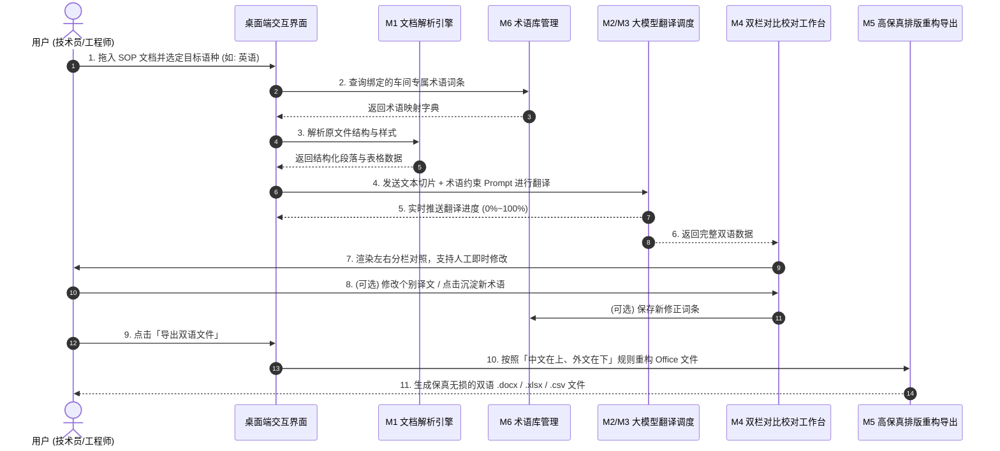

# TransFiler 制造业文档双语智能转换系统 - 产品需求文档 (PRD)

---

## 1. 产品目标和使用场景

### 1.1 产品定位与目标
**TransFiler** 是一款专为制造业工厂和工业企业打造的 **Windows 桌面端「双语文档智能制作助手」**。
其核心目标是将现有的中文工业执行文档（作业指导书 SOP、机台操作指引、工艺参数表、设备点检卡等，格式为 `.docx`、`.xlsx`、`.csv`、`.doc`）一键转换为**「中文在上、外文在下」**的标准双语文件。

### 1.2 解决的核心痛点
1. **排版崩塌与极高的人工整理成本**：传统翻译软件会将原文件的表格样式、合并单元格、边框颜色打乱，工程师翻译后需要花费数小时重新调整排版；
2. **工业专业术语误译**：通用翻译引擎无法识别工厂特有工艺、夹具与缩写（如“射胶压力”、“首件检验”、“Poka-Yoke”），容易造成车间理解偏差甚至生产事故；
3. **缺乏直观的对比与纠错工作台**：缺乏专为双语文档设计的“译前 vs 译后”左右联动校对工具，校对不方便。

### 1.3 核心使用场景
* **制造企业出海与海外建厂**：中资工厂在越南、泰国、印尼、墨西哥等海外工厂投产时，快速将国内成熟的 SOP 转化为符合当地规范的中英/中越/中泰双语 SOP；
* **外籍工程师与工人培训**：为车间跨国操作人员提供图文并茂、排版一致的标准双语作业指南；
* **客户审核与体系认证**：外资客户或 IATF 16949 / ISO 审核时，快速输出格式规范的双语受控体系文件。

---

## 2. 整体页面框架的导航结构

软件采用现代 Windows 桌面软件通用的 **「左侧固定导航栏 + 右侧主工作区」** 布局体系：

```
+-----------------------------------------------------------------------------------------------+
|  TransFiler 制造业双语文档助手  v1.0.0                                            [ — ] [ 口 ] [ ✕ ] |
+------------------+----------------------------------------------------------------------------+
|  📑 文档翻译     |                                                                            |
|                  |                                                                            |
|  🔍 对比与校对   |                             [ 右侧主工作区容器 ]                             |
|                  |                     (随左侧导航切换或按业务流程自动推进)                    |
|  📚 专有术语库   |                                                                            |
|                  |                                                                            |
|  ⚙️ 系统设置     |                                                                            |
|                  |                                                                            |
|  🕒 转换历史     |                                                                            |
+------------------+----------------------------------------------------------------------------+
```

### 导航层级与页面定义
1. **📑 文档翻译（Home / Task Entry）**：任务起始页面，负责文件导入、语种选择、术语库绑定与一键启动；
2. **🔍 对比与校对（Diff & Proofreading Studio）**：核心工作台，左右分栏展示“原始中文”与“可编辑双语”，支持单元格级即时修改；
3. **📚 专有术语库（Glossary Management）**：维护工厂专属技术词汇，支持 Excel/CSV 批量导入导出与增删改查；
4. **⚙️ 系统设置（Settings）**：配置大模型提供商（DeepSeek / OpenAI / 自定义接口）、API Key、默认导出路径等；
5. **🕒 转换历史（History Logs）**：查看过往已转换的文件记录、耗时与一键打开导出目录。

---

## 3. 首页（文档翻译工作台）的内容结构

首页是用户日常使用最频繁的入口，采用直观的卡片化流式结构：

1. **顶部状态与排版规则提示条**：
   - 当前 API 连通状态（如：`DeepSeek 引擎已就绪 ●`）；
   - 规则提示：`排版规则：中文在上 · 外文在下 | 格式保真：表格样式 100% 还原`。
2. **中央文件导入拖拽区域（Drop Zone）**：
   - 超大虚线区域，支持将文件直接从 Windows 资源管理器拖拽至窗口内；
   - 格式徽章：明确标注支持 `.docx`、`.xlsx`、`.csv`、`.doc`；
   - 已选文件卡片：显示已加载的文件名、文件大小、段落与表格初步预估统计。
3. **翻译与排版规则配置卡片**：
   - **源语言选择器**：默认固定为 `中文 (简体)`；
   - **目标语言选择器**：预置 `英语 (English)`、`越南语 (Tiếng Việt)`、`泰语 (ภาษาไทย)`、`印尼语 (Bahasa Indonesia)`、`日语 (日本語)`、`西班牙语 (Español)` 等；
   - **双语排版模式选择**：单选 `中文在上，外文在下 (推荐)` 或 `仅保留外文 (纯译文替换)`；
   - **绑定制造业术语库**：下拉选择生效的专业词典（如：`模具与注塑车间术语库` 或 `全部启用`）；
   - **模型引擎选择**：下拉切换配置的模型。
4. **底部主动作触发区**：
   - 居右放置高亮主操作按钮：`[ 🚀 开始智能双语转换 ]`；
   - 未选文件或未配 API Key 时自动禁用并显示引导气泡。

---

## 4. 每个模块的用途

| 模块名称 | 模块用途说明 |
| :--- | :--- |
| **M1: 文件解析与格式适配模块** | 底层解析 `.docx`、`.xlsx`、`.csv` 和 `.doc`，提取所有纯文本段落、表格单元格及其对应的原生样式（字体、字号、颜色、粗体、对齐方式、合并单元格信息等）。 |
| **M2: 制造业术语锁定与提示词引擎** | 结合大模型与本地 Trie 树/正则引擎，将用户自建的工厂术语表在翻译前注入提示词或进行强制后置替换，确保工艺专业名词绝对准确。 |
| **M3: 并发翻译调度模块** | 将文档内容按语义和表格切片，异步并发调用大模型 API 进行翻译，处理网络异常与重试，并计算处理进度百分比。 |
| **M4: 左右双栏对比校对工作台** | 提供“左侧原文只读 vs 右侧双语可编辑”的联动对比界面，用户可直接点击修改译文，并提供“一键将修正词加入术语库”的快捷操作。 |
| **M5: 高保真双语排版重建模块** | 根据“中文在上、外文在下”的规则重构文档。表格单元格自动启用换行并自适应撑开行高，完整继承原有边框、底色和列宽，生成最终文件。 |
| **M6: 术语库与数据管理模块** | 管理工厂自定义词汇表，支持 Excel/CSV 的一键导入导出、检索、新增、编辑与分类标签维护。 |
| **M7: 系统偏好与 API 密钥管理模块** | 管理用户大模型密钥（本地加密存储）、API 端点地址、中外文字体偏好及默认导出文件夹。 |

---

## 5. 每个模块第一版必要的数据和操作

### 5.1 文件解析与参数配置模块 (M1)
* **必要数据**：
  * 文件路径 (`filePath`)、文件名 (`fileName`)、文件大小 (`fileSize`)、文件扩展名 (`fileExt`)；
  * 源语言 (`sourceLang`)、目标语言 (`targetLang`)、选中的术语库 ID (`glossaryId`)。
* **必要操作**：
  * 文件拖入 / 点击按钮选择文件；
  * 移除已选文件 / 重新选择；
  * 下拉切换目标语言；
  * 点击「开始转换」启动后台任务。

### 5.2 智能翻译与术语引擎 (M2 & M3)
* **必要数据**：
  * 提取的文本单元列表：`[{ id, type: 'paragraph'|'table_cell', sourceText, targetText, rowIdx, colIdx, matchedTerms: [] }]`；
  * 转换进度状态：`{ currentStep, totalUnits, processedUnits, percentage, costTime }`。
* **必要操作**：
  * 异步执行翻译流程；
  * 进度实时推送与展示；
  * 取消/中止正在进行的任务。

### 5.3 双栏对比校对工作台 (M4)
* **必要数据**：
  * 对比视图数据源：原文列表与双语译文列表；
  * 修改状态标记：标记哪些单元格被人工修改过 (`isModified: boolean`)；
  * 术语命中高亮标记：标记哪些词汇命中了工厂术语库 (`isGlossaryHit: boolean`)。
* **必要操作**：
  * 左右两栏联动滚动与定位；
  * 右侧外语输入框即时失焦保存/按回车保存；
  * 快捷搜索栏：输入关键字定位段落/单元格；
  * 选中词汇右键/点击按钮「加入到术语库」。

### 5.4 高保真文件导出模块 (M5)
* **必要数据**：
  * 目标导出格式、输出文件名（默认：`原文件名_双语版_语种.后缀`）、输出目标路径。
* **必要操作**：
  * 点击「导出双语文件」；
  * 弹出成功提示弹窗，提供「打开所在文件夹」和「直接打开文件」按钮。

### 5.5 制造业专有术语库模块 (M6)
* **必要数据**：
  * 词条数据模型：`{ id, sourceTerm (中文), targetTerm (外文译文), targetLang (适用语种), category (工艺分类), isEnabled (启用状态), updatedAt }`。
* **必要操作**：
  * 列表分页展示与关键词模糊检索；
  * 导入 Excel / CSV 文件（支持字段映射匹配）；
  * 导出当前词库为 Excel / CSV；
  * 单条新建、行内编辑、删除与批量删除。

### 5.6 系统设置与 API 管理 (M7)
* **必要数据**：
  * `provider` (DeepSeek / OpenAI / Custom)；
  * `apiKey` (字符串，保存在本地本地配置文件)；
  * `baseUrl` (如 `https://api.deepseek.com/v1`)；
  * `modelName` (如 `deepseek-chat`)；
  * `defaultExportDir` (本地文件夹绝对路径)。
* **必要操作**：
  * 输入 API Key 并点击「测试连通性」验证有效性；
  * 浏览并更改默认导出路径；
  * 保存设置。

---

## 6. 各模块之间的关系与业务数据流



---

## 7. 第一版（V1）必须完成的功能

1. **多格式高保真解析**：
   - 完整支持 `.docx`（Word）和 `.xlsx`（Excel）、`.csv`，并兼容 `.doc`；
   - 严格保留 Word/Excel 中的文字加粗、字体颜色、居中/靠左对齐、背景填充色、边框样式以及合并单元格（Merged Cells）。
2. **“中文在上，外文在下”排版引擎**：
   - Word 段落：中文在上，换行后紧跟外文，格式自动继承；
   - Word 表格：单元格内部实现上下双语排列；
   - Excel 单元格：单元格内填入 `中文\n外文`，开启自动换行 (`wrap_text=True`)，并根据文字行数自适应拉伸行高，确保内容完全展示。
3. **混合翻译模式（大模型 API + 专属术语库）**：
   - 支持配置 DeepSeek / OpenAI 等兼容 API Key；
   - 术语库与 Prompt 深度融合，强制确保机台零部件、工艺技术参数名词 100% 按照工厂词典翻译。
4. **左右双栏对比与校对工作台**：
   - 左侧展示原始中文只读文档；
   - 右侧展示双语结构，外文部分支持直接点击编辑修改；
   - 带有术语库命中高亮徽章提示。
5. **工厂术语库独立管理**：
   - 支持 Excel/CSV 格式的批量导入与导出；
   - 支持界面内对词条的新增、修改、删除与分类搜索。
6. **本地一键导出**：
   - 一键将校对后的最终内容导出为排版完好的双语原格式文件。

---

## 8. 第一版（V1）暂时不做的功能

1. **图片/扫描件 OCR 翻译**：暂不包含扫描版 PDF 或图片内文字的 OCR 识别与图片擦除替换；
2. **PPT 演示文稿支持**：首期专注解决最核心的 SOP（Word）和参数表（Excel/CSV）；
3. **多人局域网协同与权限系统**：第一版设计为轻量单机桌面工具，不搭建中心数据库与用户登录系统；
4. **复杂的云端向量知识库 (RAG)**：首期采用更精准可控的“术语词典精准匹配 + 提示词注入”方案。

---

## 9. 可以实际检查的验收标准（Acceptance Criteria）

| 序号 | 验收场景 | 实际操作步骤 | 预期合格标准 |
| :---: | :--- | :--- | :--- |
| **AC-1** | **API 配置与连通性** | 在设置中填入有效的 DeepSeek API Key，点击「测试连通性」。 | 界面提示“连接成功 (Status: 200 OK)”，并能正常保存。 |
| **AC-2** | **Word (.docx) 双语排版** | 导入一份包含标题、正文、带底色工艺表格的 SOP `.docx` 文件，选择中译英并执行转换与导出。 | 1. 导出的 Word 文件段落为“中文在上，英文在下”；<br>2. 原有表格的边框、背景色、居中格式无损坏；<br>3. 单元格内文字同样为上下双语排列。 |
| **AC-3** | **Excel (.xlsx) 自适应保真** | 导入一份包含多个合并单元格、工艺参数的 `.xlsx` 文件，执行转换并导出。 | 1. 单元格内为“中文\n英文”结构；<br>2. 单元格开启自动折行，**行高自适应撑开，文字无遮挡**；<br>3. 原有单元格背景色、边框线 100% 保持原样。 |
| **AC-4** | **术语库强制匹配** | 在术语库中添加：`射胶压力 -> Injection Pressure`。导入包含“射胶压力”的文档并翻译。 | 导出的英文译文中，“射胶压力”必须严格翻译为 `Injection Pressure`，校对界面显示术语命中徽章。 |
| **AC-5** | **对比校对与即时修改** | 翻译完成后，在右侧对比栏中手动将某处外语修改为指定内容，然后导出文件。 | 导出的最终文件中，该处内容呈现为用户手动修改后的文字。 |
| **AC-6** | **术语库导入导出** | 准备一份包含 50 条制造业词汇的 Excel 术语表，点击导入；随后点击导出。 | 1. 导入后列表能正常搜索和查看这 50 条词条；<br>2. 导出的 Excel 与导入内容完全一致。 |
